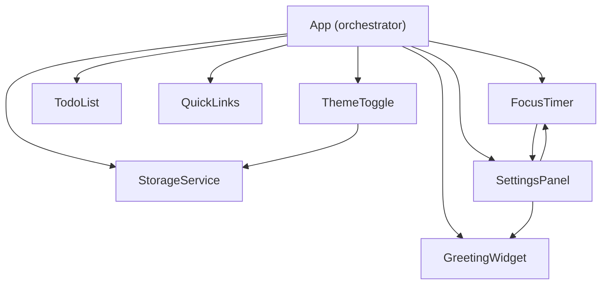

# Design Document

## Personal Productivity Dashboard

---

## Overview

The Personal Productivity Dashboard (PPD) is a single-page web application delivered as three static files: `index.html`, `css/style.css`, and `js/app.js`. It runs entirely in the browser — no server, no build step, no dependencies. All state is persisted via the Browser Local Storage API under the `ppd_` key namespace.

The application presents six interactive widgets on a single canvas:

| Widget | Purpose |
|---|---|
| Greeting Widget | Time, date, and personalized greeting |
| Focus Timer | Pomodoro-style countdown with audio alert |
| To-Do List | Task capture and completion tracking |
| Quick Links | User-defined bookmark buttons |
| Theme Toggle | Light / dark mode switch |
| Settings Panel | Display name and timer duration configuration |

A seventh non-interactive Placeholder Section reserves layout space for future features.

**Key design decisions:**
- **Zero dependencies** — no frameworks, no bundler, no npm. The app must open directly from `file://` without a web server.
- **Module-per-widget** — each widget is implemented as a plain JavaScript object (the Revealing Module Pattern) with a clear public API, eliminating global variable pollution while staying compatible with a simple `<script>` tag.
- **CSS custom properties for theming** — light and dark themes are expressed as two sets of CSS variables. A `data-theme` attribute on `<body>` switches the active set atomically, avoiding a flash of unstyled content (FOUC) when the theme is applied before the first paint.
- **Pure logic functions extracted from DOM code** — formatting, validation, and data-transformation functions are pure (no side effects) so they can be tested in isolation without a browser.

---

## Architecture

### File Structure

```
index.html          — Single HTML file; all widget markup; inline theme-init script
css/
  style.css         — All styles; CSS custom properties; light and dark token sets
js/
  app.js            — All JavaScript; module objects for each widget; StorageService; App init
```

### Initialization Sequence

The following sequence runs when the page loads, before any user interaction is possible:

```mermaid
sequenceDiagram
    participant Browser
    participant HTML (inline script)
    participant app.js
    participant StorageService
    participant Widgets

    Browser->>HTML (inline script): Parse <head>
    HTML (inline script)->>StorageService: readTheme()
    StorageService-->>HTML (inline script): "light" | "dark" | null
    HTML (inline script)->>Browser: document.body.dataset.theme = value
    Note over Browser: Theme applied before any paint — no FOUC
    Browser->>app.js: DOMContentLoaded
    app.js->>StorageService: hydrate() — read all keys
    StorageService-->>app.js: all saved data
    app.js->>Widgets: init(data) for each widget
    Widgets-->>Browser: DOM updated; user can interact
```

The theme-init inline script in `<head>` reads the theme from storage synchronously (before DOMContentLoaded fires) and sets `document.body.dataset.theme`. This eliminates FOUC. All other initialization waits for `DOMContentLoaded`.

### Module Communication

Widgets communicate through direct function calls rather than a custom event bus, since the widget count is small and fixed.



The `App` object bootstraps everything. `SettingsPanel` holds references to `GreetingWidget` and `FocusTimer` so it can push updated values reactively. `FocusTimer` holds a reference to `SettingsPanel` to disable/enable the duration input during active countdown.

---

## Components and Interfaces

### StorageService

Central adapter for `window.localStorage`. All reads and writes go through this service so that failure handling is consistent.

```js
StorageService = {
  // Key registry (all keys namespaced with ppd_)
  KEYS: {
    THEME:    'ppd_theme',
    NAME:     'ppd_name',
    DURATION: 'ppd_duration',
    TASKS:    'ppd_tasks',
    LINKS:    'ppd_links',
  },

  // Returns parsed value or null; never throws
  read(key) → any | null,

  // Returns true on success, false on failure (calls onError internally)
  write(key, value) → boolean,

  // Removes a key from storage
  remove(key) → void,

  // Reads all known keys; returns plain object { theme, name, duration, tasks, links }
  hydrate() → HydratedData,
}
```

### GreetingWidget

```js
GreetingWidget = {
  init(name) → void,              // Renders initial state
  setName(name) → void,           // Called by SettingsPanel on save

  // Pure logic (exported for testing)
  formatTime(hour, minute) → string,           // "HH:MM"
  formatDate(date) → string,                   // "Weekday, Month D, YYYY"
  getGreetingPrefix(hour) → string,            // "Good morning" | "Good afternoon" | ...
  buildGreeting(prefix, name) → string,        // "Good morning, Alex" or "Good morning"
}
```

A `setInterval` ticks every minute to update the displayed time (started during `init`).

### FocusTimer

```js
FocusTimer = {
  init(durationMinutes) → void,   // Renders initial state with given or default duration
  setDuration(minutes) → void,    // Called by SettingsPanel when a new duration is saved

  // State transitions
  start() → void,
  stop()  → void,
  reset() → void,

  // Pure logic (exported for testing)
  formatTimer(totalSeconds) → string,             // "MM:SS" zero-padded
  validateTimerDuration(value) → ValidationResult, // { valid, error }

  // Internal: uses setInterval for 1-second ticks; uses AudioService for alert
}

TimerState = 'idle' | 'running' | 'paused' | 'completed'
```

### AudioService

Thin wrapper around the Web Audio API. Synthesizes a short beep using an `OscillatorNode` so no audio file is required.

```js
AudioService = {
  // Plays a sine-wave beep at 440 Hz for durationSeconds (1–3)
  // Silently swallows errors (autoplay policy, missing AudioContext)
  playAlert(durationSeconds) → void,
}
```

### TodoList

```js
TodoList = {
  init(tasks) → void,             // Renders saved tasks in order

  // Pure logic (exported for testing)
  validateTask(description) → ValidationResult,   // { valid, error }
  serializeTasks(tasks) → string,                 // JSON string
  deserializeTasks(json)  → Task[],               // Array of Task objects

  // Mutations (each calls StorageService.write on success)
  addTask(description) → void,
  editTask(id, description) → void,
  toggleComplete(id) → void,
  deleteTask(id) → void,
}

Task = { id: string, description: string, completed: boolean, createdAt: number }
```

### QuickLinks

```js
QuickLinks = {
  init(links) → void,

  // Pure logic (exported for testing)
  validateLink(label, url) → ValidationResult,   // checks empty, length, duplicate
  normalizeUrl(url) → string,                    // prepends "https://" if no protocol

  // Mutations
  addLink(label, url) → void,
  deleteLink(id) → void,
}

Link = { id: string, label: string, url: string }
```

### ThemeToggle

```js
ThemeToggle = {
  init(savedTheme) → void,

  // Pure logic
  toggleTheme(current) → string,   // 'light' → 'dark', 'dark' → 'light'

  // Applies theme to DOM and writes to storage
  applyTheme(theme) → void,
}
```

### SettingsPanel

```js
SettingsPanel = {
  init(savedName, savedDuration) → void,

  // Called by FocusTimer when countdown starts/stops
  lockDurationInput()   → void,
  unlockDurationInput() → void,

  // Pure logic
  sanitizeName(raw) → string,           // raw.trim().slice(0, 50)
  validateDuration(value) → ValidationResult,   // integer in [1, 120]
}
```

### NotificationService

Lightweight service that appends a toast element to the DOM, shows it for 1–3 seconds, then removes it. Used for non-blocking save confirmations and storage error messages.

```js
NotificationService = {
  show(message, type) → void,   // type: 'success' | 'error' | 'info'
}
```

### PlaceholderSection

Static HTML with no associated JavaScript module. The section is rendered by the HTML and styled by CSS using the same theme tokens as all other widgets.

---

## Data Models

### Storage Keys and Shapes

| Key | Type stored | Default | Notes |
|---|---|---|---|
| `ppd_theme` | `"light"` \| `"dark"` | `"light"` | Applied before first paint |
| `ppd_name` | `string` | absent | Absent key → no name displayed |
| `ppd_duration` | `number` (integer, minutes) | `25` | Range 1–120 |
| `ppd_tasks` | JSON array of `Task` | `[]` | Ordered by creation time |
| `ppd_links` | JSON array of `Link` | `[]` | Max 20 entries |

### Task

```js
{
  id:          string,   // crypto.randomUUID() or Date.now().toString(36)
  description: string,   // 1–500 characters, non-whitespace-only
  completed:   boolean,
  createdAt:   number,   // Unix timestamp ms
}
```

### Link

```js
{
  id:    string,   // crypto.randomUUID()
  label: string,   // 1–50 characters
  url:   string,   // 1–2048 characters; always starts with http:// or https://
}
```

### ValidationResult

```js
{
  valid: boolean,
  error: string | null,   // Human-readable message, null when valid
}
```

### HydratedData

```js
{
  theme:    string,    // "light" | "dark"
  name:     string,    // "" if absent
  duration: number,    // 25 if absent
  tasks:    Task[],    // [] if absent or corrupt
  links:    Link[],    // [] if absent or corrupt
}
```

### Theme Token Map (CSS Custom Properties)

```css
/* Light theme (default) */
[data-theme="light"] {
  --color-bg:          #f9f9f9;
  --color-surface:     #ffffff;
  --color-border:      #e0e0e0;
  --color-text:        #1a1a1a;
  --color-text-muted:  #666666;
  --color-accent:      #2563eb;
  --color-accent-hover:#1d4ed8;
  --color-success:     #16a34a;
  --color-error:       #dc2626;
  --color-strikethrough: #9ca3af;
}

/* Dark theme */
[data-theme="dark"] {
  --color-bg:          #111827;
  --color-surface:     #1f2937;
  --color-border:      #374151;
  --color-text:        #f9fafb;
  --color-text-muted:  #9ca3af;
  --color-accent:      #60a5fa;
  --color-accent-hover:#93c5fd;
  --color-success:     #4ade80;
  --color-error:       #f87171;
  --color-strikethrough: #6b7280;
}
```

All interactive controls use `var(--color-accent)` as their primary action color, ensuring consistency across both themes. All widgets consume only these tokens — no hardcoded color values in CSS rules.

---

## Correctness Properties

*A property is a characteristic or behavior that should hold true across all valid executions of a system — essentially, a formal statement about what the system should do. Properties serve as the bridge between human-readable specifications and machine-verifiable correctness guarantees.*

---

### Property 1: Time Format Correctness

*For any* hour in [0, 23] and minute in [0, 59], `formatTime(hour, minute)` shall return a string matching `HH:MM` where both components are zero-padded to exactly two digits and numerically equal to the inputs.

**Validates: Requirements 1.1**

---

### Property 2: Date Format Completeness

*For any* `Date` object, `formatDate(date)` shall return a string that contains a valid English weekday name (Monday–Sunday) and a valid English month name (January–December).

**Validates: Requirements 1.3**

---

### Property 3: Greeting Prefix Exhaustiveness

*For any* integer hour in [0, 23], `getGreetingPrefix(hour)` shall return exactly one of `"Good morning"`, `"Good afternoon"`, `"Good evening"`, or `"Good night"`, with the specific mapping:
- [5, 11] → `"Good morning"`
- [12, 17] → `"Good afternoon"`
- [18, 21] → `"Good evening"`
- [22, 23] ∪ [0, 4] → `"Good night"`

**Validates: Requirements 1.4, 1.5, 1.6, 1.7**

---

### Property 4: Greeting Assembly

*For any* greeting prefix string and any non-empty, non-whitespace name string, `buildGreeting(prefix, name)` shall return a string equal to `prefix + ", " + name`. *For any* prefix with a null, undefined, or whitespace-only name, `buildGreeting` shall return `prefix` exactly.

**Validates: Requirements 1.9, 1.10**

---

### Property 5: Timer Display Format

*For any* integer `seconds` in [0, 10800], `formatTimer(seconds)` shall return a string matching `MM:SS` where minutes = `Math.floor(seconds / 60)` and secs = `seconds % 60`, both zero-padded to two digits.

**Validates: Requirements 2.1**

---

### Property 6: Timer Duration Validation Range (widget input)

*For any* integer value in [1, 180], `validateTimerDuration(value)` shall return `{ valid: true }`. *For any* value outside [1, 180], or any non-integer, it shall return `{ valid: false, error: <non-empty string> }`.

**Validates: Requirements 2.11**

---

### Property 7: Task Addition Grows List

*For any* task list and any description string that is non-empty, non-whitespace-only, and at most 500 characters, calling `addTask(description)` shall produce a new list whose length equals the original length plus one, and whose last entry has the given description and `completed: false`.

**Validates: Requirements 3.1**

---

### Property 8: Whitespace Task Rejection

*For any* string composed entirely of whitespace characters (spaces, tabs, newlines), `validateTask(description)` shall return `{ valid: false, error: <non-empty string> }`, and the task list shall remain unchanged after an attempted add.

**Validates: Requirements 3.2**

---

### Property 9: Completion Toggle Round-Trip

*For any* task, calling `toggleComplete` twice shall restore the task's `completed` field to its original value.

**Validates: Requirements 3.5**

---

### Property 10: Task Storage Round-Trip

*For any* array of `Task` objects, `deserializeTasks(serializeTasks(tasks))` shall produce an array that is deeply equal to the original (same ids, descriptions, completion states, and order).

**Validates: Requirements 3.7, 3.8**

---

### Property 11: Link Addition Grows Collection

*For any* link collection with fewer than 20 entries, and any valid (label, url) pair (label 1–50 chars, url 1–2048 chars), calling `addLink(label, url)` shall produce a new collection whose length equals the original length plus one, and whose last entry has the given label and the normalized url.

**Validates: Requirements 4.1**

---

### Property 12: Link Input Validation Rejection

*For any* input where the label is empty, or the url is empty, or the label exceeds 50 characters, or the url exceeds 2048 characters, or the url already exists in the collection, `validateLink(label, url)` shall return `{ valid: false, error: <non-empty string> }`, and the collection shall remain unchanged after an attempted add.

**Validates: Requirements 4.2, 4.3, 4.5**

---

### Property 13: URL Protocol Normalization

*For any* URL string that does not begin with `"http://"` or `"https://"`, `normalizeUrl(url)` shall return a string that begins with `"https://"` followed by the original url string. *For any* URL that already begins with `"http://"` or `"https://"`, `normalizeUrl` shall return the url unchanged.

**Validates: Requirements 4.4**

---

### Property 14: Links Storage Round-Trip

*For any* array of `Link` objects, serializing and then deserializing the collection through the same JSON path used by `StorageService` shall produce an array that is deeply equal to the original (same ids, labels, urls, and order).

**Validates: Requirements 4.8, 4.9**

---

### Property 15: Theme Toggle Round-Trip

*For any* theme value (`"light"` or `"dark"`), applying `toggleTheme(toggleTheme(theme))` shall return the original theme value.

**Validates: Requirements 5.2**

---

### Property 16: Display Name Trimming

*For any* name string with leading and/or trailing whitespace, `sanitizeName(name)` shall return a value equal to `name.trim()`.

**Validates: Requirements 6.2**

---

### Property 17: Display Name Length Cap

*For any* name string of any length, `sanitizeName(name)` shall return a value whose length is at most 50 characters.

**Validates: Requirements 6.5**

---

### Property 18: Settings Duration Validation Range

*For any* integer value in [1, 120], `validateDuration(value)` shall return `{ valid: true }`. *For any* value outside [1, 120] or any non-numeric value, it shall return `{ valid: false, error: <non-empty string> }`.

**Validates: Requirements 7.2, 7.4**

---

### Property 19: Storage Key Namespace

*For any* key name string passed to `StorageService`, the actual key written to `window.localStorage` shall begin with `"ppd_"`.

**Validates: Requirements 9.5**

---

### Property 20: WCAG AA Contrast Ratio

*For every* (foreground, background) color-token pair used in the light theme and the dark theme, the WCAG 2.1 relative luminance contrast ratio shall be at least 4.5 : 1.

**Validates: Requirements 11.3**

---

## Error Handling

### Storage Failures

`StorageService.read` and `StorageService.write` wrap every `localStorage` call in a `try/catch`. On failure:

- **Read failure** → returns `null`; the calling widget falls back to its default state; `NotificationService.show("Could not load saved data", "error")` is called once during hydration.
- **Write failure** → returns `false`; the in-memory state is still updated (the UI remains consistent for the session); `NotificationService.show("Change could not be saved", "error")` is shown to the user.

This ensures the app remains fully usable even when storage is unavailable (e.g., private browsing mode in some browsers, exceeded storage quota).

### Audio Playback Failures

`AudioService.playAlert` wraps `AudioContext` creation and `oscillator.start()` in a `try/catch`. If the browser blocks audio (autoplay policy) or `AudioContext` is unavailable, the error is silently swallowed. The visual completion state of the timer is unaffected.

### Invalid Storage Data

When `StorageService.hydrate` reads `ppd_tasks` or `ppd_links`, it calls `JSON.parse` inside a `try/catch`. If the stored value is corrupt (not valid JSON or not an array), the widget initializes with an empty collection and the error notification is shown.

### Timer Concurrent Start Guard

`FocusTimer.start` checks whether the timer state is already `'running'` before starting a new interval. If it is, the call is a no-op. This prevents double-interval accumulation without needing to surface an error to the user.

### Input Validation

All user inputs are validated client-side before any state mutation or storage write:

| Widget | Validation checks |
|---|---|
| TodoList | Non-empty, non-whitespace, ≤ 500 chars |
| QuickLinks | Non-empty label and URL, label ≤ 50, URL ≤ 2048, unique URL, collection < 20 |
| SettingsPanel (name) | Trimmed; max 50 chars; empty/whitespace → remove key |
| SettingsPanel (duration) | Integer in [1, 120]; non-numeric → show error; empty → restore default 25 |
| FocusTimer (direct) | Integer in [1, 180] |

Validation functions return `{ valid: boolean, error: string | null }`. On invalid input, the calling widget displays the error string as an inline message adjacent to the failing field; no storage write occurs.

---

## Testing Strategy

### Overview

The testing approach uses two complementary layers:

1. **Property-based tests** — verify universal invariants of pure logic functions across hundreds of randomly generated inputs. These catch edge cases that example-based tests miss.
2. **Example-based unit tests** — verify specific behaviors, state transitions, DOM updates, and error paths with concrete, readable scenarios.

Integration and smoke tests are described separately (manual or Playwright-based).

### Property-Based Testing Library

[**fast-check**](https://fast-check.dev/) is used for property-based testing. It is the de-facto standard PBT library for JavaScript, generates shrinkable counterexamples, and runs in Node.js with no browser required.

Each property test is configured to run a **minimum of 100 iterations** via `fc.assert(fc.property(...), { numRuns: 100 })`.

Each test is tagged with a comment in the format:
```
// Feature: personal-productivity-dashboard, Property N: <property_text>
```

### Test File Layout

All tests run with the project's test runner (e.g., Vitest or Jest) in Node.js — no browser required for the pure-logic layer.

```
tests/
  unit/
    greeting.test.js         // Properties 1–4: formatTime, formatDate, getGreetingPrefix, buildGreeting
    timer.test.js            // Properties 5–6: formatTimer, validateTimerDuration
    todo.test.js             // Properties 7–10: addTask, whitespace rejection, toggle, serialization
    links.test.js            // Properties 11–14: addLink, validation, normalizeUrl, serialization
    theme.test.js            // Property 15: toggleTheme
    settings.test.js         // Properties 16–18: sanitizeName, validateDuration
    storage.test.js          // Property 19: key namespace
    contrast.test.js         // Property 20: contrastRatio for all token pairs
  integration/
    hydration.test.js        // Full init with seeded localStorage mock
    storage-failure.test.js  // StorageService error paths
  e2e/
    smoke.test.js            // Playwright: open from file://, no console errors
```

### Property Test Coverage

Each of the 20 Correctness Properties maps to exactly one property-based test, run with `fc.assert` at ≥ 100 iterations:

| Property | Test file | fast-check Arbitrary |
|---|---|---|
| P1 formatTime | greeting.test.js | `fc.integer(0,23)`, `fc.integer(0,59)` |
| P2 formatDate | greeting.test.js | `fc.date()` |
| P3 greetingPrefix | greeting.test.js | `fc.integer(0,23)` |
| P4 buildGreeting | greeting.test.js | `fc.string()`, `fc.option(fc.string())` |
| P5 formatTimer | timer.test.js | `fc.integer(0,10800)` |
| P6 validateTimerDuration | timer.test.js | `fc.integer()` |
| P7 addTask grows list | todo.test.js | `fc.string({ minLength: 1, maxLength: 500 })` filtered for non-whitespace |
| P8 whitespace rejection | todo.test.js | `fc.stringOf(fc.constantFrom(' ', '\t', '\n'))` |
| P9 toggle round-trip | todo.test.js | `fc.record({ completed: fc.boolean() })` |
| P10 task serialization round-trip | todo.test.js | `fc.array(fc.record({ id: fc.string(), description: fc.string(), completed: fc.boolean(), createdAt: fc.integer() }))` |
| P11 addLink grows list | links.test.js | `fc.string(1,50)`, `fc.webUrl()` |
| P12 invalid link rejection | links.test.js | multiple generator shapes per invalid case |
| P13 normalizeUrl | links.test.js | `fc.string()` filtered for non-protocol strings |
| P14 links serialization round-trip | links.test.js | `fc.array(fc.record({ id, label, url }))` |
| P15 toggleTheme round-trip | theme.test.js | `fc.constantFrom('light', 'dark')` |
| P16 sanitizeName trim | settings.test.js | `fc.string()` with padding added |
| P17 sanitizeName cap | settings.test.js | `fc.string({ minLength: 0, maxLength: 200 })` |
| P18 validateDuration | settings.test.js | `fc.integer()` and `fc.oneof(fc.string(), fc.float())` |
| P19 storage key namespace | storage.test.js | `fc.string()` |
| P20 contrastRatio | contrast.test.js | `fc.constantFrom(...allTokenPairs)` |

### Unit Test Coverage (Example-Based)

Key example-based scenarios not covered by property tests:

- Timer state machine: idle → running → paused → idle → completed transitions
- Timer start-while-running is a no-op
- Audio alert: mock `AudioContext`; assert oscillator created and `start`/`stop` called with correct timing
- Audio failure: mock `AudioContext` constructor to throw; assert no unhandled error
- Storage read failure: mock `localStorage.getItem` to throw; assert default state rendered and notification shown
- Storage write failure: mock `localStorage.setItem` to throw; assert notification shown, in-memory state preserved
- Theme applied before first paint: assert `data-theme` attribute set synchronously during script parse
- Settings panel locks/unlocks duration input when timer starts/stops
- Empty state messages: tasks empty, links empty

### Integration Tests

- Full `hydrate()` round-trip with a mock `localStorage` seeded with all keys
- Corrupt storage data (non-JSON in `ppd_tasks`) → empty list + notification

### Smoke / E2E Tests (Playwright)

- Open `index.html` via `file://` protocol in Chromium, Firefox, and WebKit
- Assert zero console errors during normal operation
- Assert initial render completes (widgets visible) within 2 seconds
- Assert responsive layout at 320px, 768px, 1440px, and 2560px viewport widths
- Assert all interactive controls have minimum 44×44 computed touch target size

### Accessibility

- Run [axe-core](https://github.com/dequelabs/axe-core) assertions in Playwright to flag WCAG 2.1 AA violations (focus indicators, ARIA roles, contrast)
- Manual keyboard navigation walkthrough for focus order and visible focus rings

> **WCAG compliance note:** Full validation requires manual testing with assistive technologies (screen readers, switch access) and expert accessibility review beyond automated tooling.
